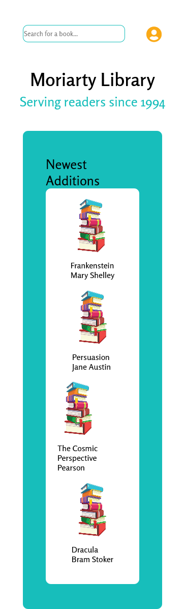
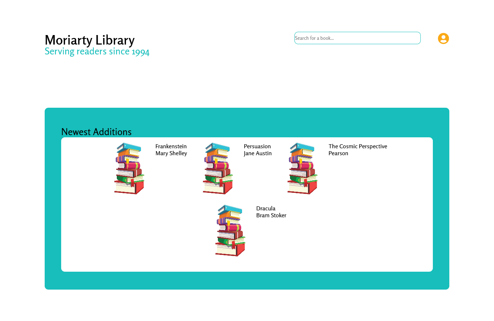
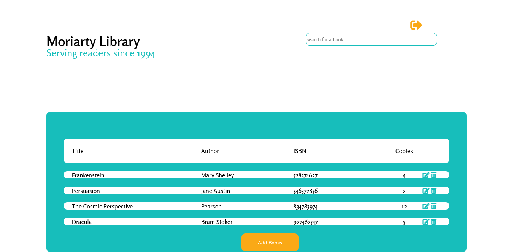

# Library App - CRUD books as a librarian

This is a library app that uses PHP and MySQL. It lets the user login, search for, add, and remove books.

## Table of contents

- [Overview](#overview)
  - [Screenshot](#screenshot)
  - [Links](#links)
- [My process](#my-process)
  - [Built with](#built-with)
  - [What I learned](#what-i-learned)
  - [Continued development](#continued-development)
  - [Useful resources](#useful-resources)

## Overview

### Screenshots

  

### Links

- Live Site URL: [https://juliaarrington.com/library/index.php](Live Site)

## My process

### Built with

- Semantic HTML5 markup
- CSS grid
- PHP
- MySql
- MySQLi
- media quires

### What I learned

I learned a lot about PHP, like how to create login functionality. I also learned about MySQLi and that is something I want to work with more in the future. This is the first multi-page website I've created, so in the future I will design my file trees better and plan modular CSS better.

### Continued development

This app has the basic features of a CRUD app, but it could have more features to make it a useful library app, including, but not limited to:

- User profiles
- Book pages
- Improve look and feel

### Useful resources

- [Login Menu](https://codepen.io/colorlib/pen/rxddKy) - I modified this menu for my project in an attempt to speed up development time.
- [login PHP tutorial](https://codeshack.io/secure-login-system-php-mysql/) - Big credit to this tutorial for setting me on the right path for creating the login system.
- [update tutorial](https://www.11zon.com/zon/php/how-to-update-data-in-php-using-form-mysqli.php) - This is the tutorial that "forced" me to learn about MySQLi. The whole update functionality gave me some trouble.
- [Click out to close](https://codepen.io/nbalaguer/pen/PVbEjm) - I used this code pen as a start for the login menu, but I had to make some modifications so that the PHP script would still work.
